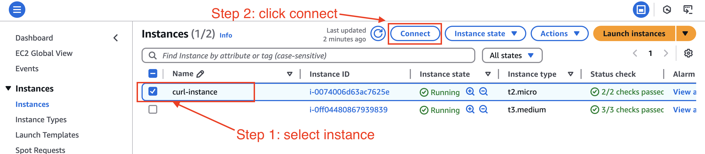
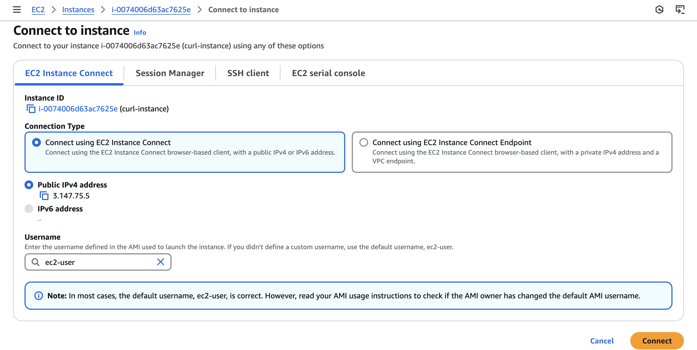

## Excercise # 1 - Basic Deployment
1. Ensure you have connectivity to your local kubernetes cluster
2. Apply the `basic-deployment.yml` deployment configuration file. 
3. Take a screenshot of the running pods: `kubectl get pods -n udacity`
4. Document the image number in the `nginx-basic` deployment
   1. `kubectl describe deployment nginx-basic`
5. Now we will initiate a basic deployment for a newer version of nginx using `basic-deployment-image-bump.yml`
   1. `kubectl delete -f basic-deployment.yml`
   2. `kubectl apply -f basic-deployment-image-bump.yml`
6. Take a screenshot of the running pods: `kubectl get pods -n udacity`
7. Document the image number in the `nginx-basic` deployment
    1. `kubectl describe deployment nginx-basic`
8. Tear down environment
    1. `kubectl delete all --all -n udacity`

## Excercise # 2 - Rolling Deployment
1. Ensure you have connectivity to your local kubernetes cluster
2. Apply the `rolling_deploy.yml` deployment configuration file.
3. Take a screenshot of the running pods: `kubectl get pods -n udacity`
4. Document the image number in the `nginx-rolling` deployment
5. Now we will initiate a rolling deployment for a newer version of nginx via a bash script
   1. create a bash script `rolling.sh`
   2. Use the command `kubectl set image deployment nginx-rolling nginx=nginx:1.21.1` to upgrade the deployment image version
   3. Create a loop that waits for the deployment to roll out. Use this boilerplate code to create the for loop
    ```
    ATTEMPTS=0
    ROLLOUT_STATUS_CMD="kubectl rollout status deployment/nginx-rolling -n udacity"
    until $ROLLOUT_STATUS_CMD || [ $ATTEMPTS -eq 60 ]; do
    $ROLLOUT_STATUS_CMD
    ATTEMPTS=$((attempts + 1))
    sleep 1
    echo "Deployment still rolling out..."
    done
    ```
   4. echo at the end the script the deployment is finished.
6. Now we will do the opposite and rollback the deployment to the previous version `1.20.1` and pause halfway through
   1. Update your script with the older image number then execute
   2. In a separate terminal pause the deployment with `kubectl rollout pause deployment nginx-rolling`
   3. Document the number of old and new versions deployed
   4. Then resume the deployment `kubectl rollout resume deployment nginx-rolling`
7. Tear down environment
   1. `kubectl delete all --all -n udacity`

## Excercise # 3 - Canary Deployment
1. Ensure you have connectivity to your local kubernetes cluster
2. Apply the `index_v1_html.yml` & `index_v2_html.yml` configmaps to deploy the service html templates.
3. Deploy the v1 & v2 starter template and service to the cluster `canary-v1.yml`, `canary-v2.yml` & `canary-svc.yml`
   1. you'll notice v2 has `0` replicas 
4. Get the service cluster ip address and curl it 5 times to confirm only v1 of the application is reachable
   1. `kubectl get service canary-svc`
   2. Use an ephermeral container to access the kubernetes internal network
      1. `kubectl run debug --rm -i --tty --image nicolaka/netshoot -- /bin/bash`
      2. `curl <service_ip`
5. Now we will initiate a canary deployment for `canary-v2` via a bash script
   1. create a bash script `canary.sh` and create a function called `canary_deploy` which will house your execution code
   3. Deploy `canary-v2.yml` in incrementally by 2 while reducing the number of `canary-v1` replicas. Pause after every deployment for manual verification
      1. use `kubectl get pods -n udacity | grep -c canary-v1` to get the number of pod replicas for each app
      2. use `kubectl scale deployment canary-v2 --replicas=<number to scale by>` to increase/decrease pod replicas
      3. use bash while loops to keep the deployment running until v1 is scale down to 0
   ```
   while [ $(kubectl get pods -n udacity | grep -c canary-v1) -gt 0 ]
   do
      canary_deploy
      manual_verification
   done
   ```

      4. use this code snippet to ask for a user prompt
   ```
   function manual_verification {
     read -p "Continue deployment? (y/n) " answer
   
       if [[ $answer =~ ^[Yy]$ ]] ;
       then
           echo "continuing deployment"
       else
           exit
       fi
   }
   ```
6. Execute the script to deploy your application. 
7. During the first manual verification step ensure you can curl the service and get a response from both versions of the application.
   1. Then continue until all replicas of v2 are deployed

8. Tear down environment
   1. `kubectl delete all --all -n udacity`

## Excercise # 4 - Blue Green Deployment
1. Log into your student AWS account and switch to region `us-east-2`
2. Setup your local aws credentials
3. Launch the kubernetes cluster in starter terraform code provided
   1. `terraform init`
   2. `terraform plan`
   3. `terraform apply`
4. Ensure you have connectivity to your aws kubernetes cluster
   1.`aws eks --region us-east-2 update-kubeconfig --name udacity-cluster`
   2.Change Kubernetes context to the new AWS cluster
   - `kubectl config use-context arn:aws:eks:us-east-2:225791329475:cluster/udacity-cluster`
   3. Confirm with: `kubectl get pods --all-namespaces`
   4. Change context to `udacity` namespace
      - `kubectl config set-context --current --namespace=udacity`
5. Apply the `index_blue_html.yml` & `index_green_html.yml` configmaps to deploy the service html templates.
6. Deploy the blue application to the cluster `blue.yml`
7. You'll notice there is a load balancer service created for you in the `kubernetes_resources.tf`
   1. There is also an associated dns zone `udacityexercise` in `dns.tf` that allows you to curl the hostname `blue-green.udacityexercise` from an ec2 instance
   2. Confirm you can curl this hostname from the created `curl-instance` ec2 instance
      1. Connect to the ec2 instance via EC2 Instance Connect
         1. 
         2. 
      2. `curl blue-green.udacityexercise`
      3. take a screenshot
8. Mimic the `blue.yml` deployment script and create a `green.yml` which replaces all references of blue with green.
9. Mimic the `blue` service in `kubernetes_resources.tf` and create one for the green service
10. Mimic the dns record `resource "aws_route53_record" "blue"` for blue in `dns.tf` and create one for green with the set identifier of `green`
11. Connect to the `curl-instance` and confirm you can receive results from both services
    1. Take a screenshot
12. Delete the blue DNS record from terraform and apply it
13. Connect to the `curl-instance` and confirm you only receive results from the green service
14. Tear down environment
    1. `terraform destroy` may need to run this multiple times

# Additional Resources

## Visualizing Local Kubernetes Cluster
You may visualize your local kubernetes cluster using the `ops-view` deployment found in the [visual-support](https://github.com/udacity/nd087-c3-self-healing-architectures-exercises/tree/7ff0779bfbc514ca11334bd3912d8d6060e50533/lesson-2-deployment-strategies/exercises/starter/visual-support) directory
1. `kubectl apply -f visual-support/ops-view.yml`
1. Visit the URL `http://localhost:30092/` on your browser

Remove this deployment using: `kubectl delete -f visual-support/ops-view.yml`

## Visualizing AWS EKS Cluster
You may visualize your AWS EKS cluster using the helm chart `kube-ops-view`

1. Install [helm](https://helm.sh/docs/intro/install/)
2. Add the stable repo: `helm repo add christianhuth https://charts.christianhuth.de`
3. Install the helm chart `kube-ops-view`
    ```
    helm install kube-ops-view \
    christianhuth/kube-ops-view \
    --set service.type=LoadBalancer \
    --set rbac.create=True
    ```
4. Confirm the helm chart is installed successfully
   - `helm list`

5. Get the service URL to view the cluster dashboard
- `kubectl get svc kube-ops-view | tail -n 1 | awk '{ print "Kube-ops-view URL = http://"$4 }'`

Remove this deployment using: `helm uninstall kube-ops-view`   

## Kubernetes Helper Libraries
- [Kubectx](https://github.com/ahmetb/kubectx#kubectx1)
- [kubens](https://github.com/ahmetb/kubectx#kubens1)

